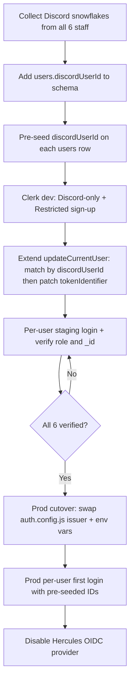

# DISCORD_MIGRATION_FEASIBILITY.md

> **Feasibility audit only — no code or data was modified.**  
> Re-evaluates the Discord-only Clerk migration plan given that **staff could not
> previously authenticate with Discord** under Hercules. Grounded in live export data
> at `../convex-export/` and auth/schema code in this repo.

---

## Executive summary

| Question | Answer |
| --- | --- |
| What did staff use to log in before? | **Hercules OIDC only** — almost certainly Google and/or email via Hercules’ upstream broker, **not Discord** |
| Discord on `users` table? | **No** — zero Discord fields in schema or export |
| Discord anywhere in DB? | **Yes** — on **`players`** and other community tables, **not linked to auth users** |
| Automatic Discord matching possible? | **No** — not reliably; no auth history, no FK, and username heuristics fail for 4 of 6 staff rows |
| Manual linking required? | **Yes** — all six existing user rows need an explicit Discord snowflake → user mapping before cutover |
| Safest path | **Pre-seed `discordUserId` on each `users` row, then in-place `tokenIdentifier` re-key on first Discord login** — never insert duplicate rows |

The prior `DISCORD_ONLY_MIGRATION.md` assumed Discord snowflakes could be the primary
re-link key. That remains correct **as a target**, but this audit shows those snowflakes
**do not exist on auth records today** and cannot be inferred automatically for most staff.

---

## 1. Which providers existing users likely used

### What the code actually configured

Production auth (Hercules, on `origin/main`) was a **single OIDC client** pointing at the
Hercules-hosted issuer:

| Setting | Value | Implication |
| --- | --- | --- |
| `authority` | `VITE_HERCULES_OIDC_AUTHORITY` → `https://hercules.app` | One broker; no Discord OAuth in this app |
| `scope` | `openid profile email offline_access` (default) | Email and profile come from upstream IdP |
| `prompt` | `select_account` (default) | User picks among upstream accounts at login |
| Callback | `/auth/callback` | Standard authorization-code + PKCE |

There is **no Discord OAuth client**, no Discord redirect URI, and no Discord-specific
scope or connection anywhere in the Hercules auth stack. Discord integration in this app
is **server-side** (bot sync into `players`), completely separate from staff login.

### What the user export shows

All **6** rows in `convex-export/users/documents.jsonl` share:

- **Issuer:** `https://hercules.app|…`
- **Non-empty `email`** on every row (from OIDC `profile` / `email` claims)
- **Two subject formats** (legacy random string vs `usr_01K…` ULID) — both are Hercules
  subjects, not Discord snowflakes

| Username | Email | Role | Hercules subject style |
| --- | --- | --- | --- |
| `plumbry` | bryonyleenewnham@gmail.com | admin | Legacy random |
| `plumalt` | brylee1975@gmail.com | admin | Legacy random |
| `plumbrytv` | plumbrytv@gmail.com | event_mod | Legacy random |
| `billy` | billychurch1@outlook.com | admin | Legacy random |
| *(no username)* | billychurchbills@gmail.com | *(none)* | `usr_01K…` ULID |
| `cherko` | cherkoyt@gmail.com | *(none)* | `usr_01K…` ULID |

### Likely upstream providers (inferred)

Hercules acts as an OIDC **broker**. With `select_account` and the `email` scope, staff
most likely signed in through one or more of:

1. **Google** (very common for Hercules-hosted apps and matches the Gmail/Outlook emails stored)
2. **Email / magic link** (if Hercules exposed it in the account picker)
3. **Another upstream OAuth provider** Hercules configured for this site — still **not Discord**

**Conclusion:** Existing users authenticated via **Hercules-brokered OIDC (likely Google
and/or email)**. Discord was used for **community/player data**, not staff identity. A
Discord-only Clerk cutover is a **net-new login method** for every staff member, not a
continuation of prior auth.

---

## 2. Whether Discord identity exists anywhere in the current database

### On the auth `users` table — **no**

`convex/schema.ts` defines `users` with only:

```
tokenIdentifier, name?, email?, username?, role?
```

The export confirms: **no `discordUserId`, `discordUsername`, or external-account fields**
on any of the 6 user rows.

### On community / operational tables — **yes, extensively**

Discord identifiers exist elsewhere but serve **player roster and ops data**, not login:

| Table / area | Discord fields | Purpose | Linked to `users._id`? |
| --- | --- | --- | --- |
| `players` | `discordUserId`, `discordUsername`, `discordRoles`, … | Roster synced from Discord guild | **No** — only `createdBy` → user who imported/synced |
| `applications` | `discordId`, `discordUsername` | Applicant identity | **No** — `processedBy` is staff user |
| `evaluations` | `discordUsername`, `discordUserId?` | Player evaluations | **No** |
| `statusEvents`, `auditLogs`, etc. | Various | Operational history | References staff by `users._id`, not Discord |

There is **no `users` ↔ `players` foreign key** and no shared unique key between auth
users and player records.

### Heuristic overlap (not authoritative)

Searching `players` for Discord handles that resemble staff **app usernames** or emails:

| Staff user | App username | Plausible `players` match | Confidence |
| --- | --- | --- | --- |
| `plumbry` | plumbry | `discordUsername: "plumbry"`, `discordUserId: 684933831874183168` (ADMIN / SERVER MOD roles) | **High** — username + role alignment |
| `cherko` | cherko | `discordUsername: "cherkoyt"`, `discordUserId: 1101530624998781039` (OWNER role) | **High** — email prefix + OWNER role |
| `plumalt` | plumalt | **No** `discordUsername: "plumalt"` in export | **None** — alt account may use a different Discord handle |
| `plumbrytv` | plumbrytv | **No** match for plumbrytv / PlumBryTV | **None** |
| `billy` (admin) | billy | `billyliako` exists but epic is `BillyLiakoFNC` — likely a **community player**, not the admin | **Low / reject** |
| Billy (no username) | — | No safe match | **None** |

These overlaps are **research hints only**. They must not be used for automated migration
because:

- Discord usernames change; snowflakes do not — but snowflakes are not on `users` yet
- One person may have multiple Discord accounts (`plumbry` vs `plumalt` vs `plumbrytv`)
- A player row does not prove which Discord account was used for staff login (staff never
  logged in with Discord)

---

## 3. Whether automatic Discord account matching is possible

### Methods evaluated

| Method | Feasible? | Why |
| --- | --- | --- |
| Match prior Discord OAuth subject | **No** | Discord was never an auth provider; Hercules subjects are not Discord IDs |
| Match Clerk Discord login → existing row via stored `users.discordUserId` | **No (today)** | Field does not exist on `users` |
| Email fallback in `updateCurrentUser` | **Unreliable for Discord-only** | Requires `identity.emailVerified === true` and exact email match; Discord often withholds email or returns a Discord-owned address that differs from Google/Outlook used with Hercules |
| Auto-match `players.discordUsername` ↔ `users.username` | **Unsafe** | No FK; 4/6 staff have no exact match; wrong link orphans ~6,300 records if `plumbry` is mis-linked |
| Auto-match by email domain / display name | **Unsafe** | Multiple Bryony accounts; two Billy accounts; high collision risk |
| Clerk Restricted allowlist alone | **N/A for re-link** | Controls who can **sign up** in Clerk; does not map Clerk user → existing Convex `users._id` |

### Partial automation after schema work

Once `discordUserId` is **manually verified and pre-seeded** on each `users` row, first
Discord login *can* be automated by extending `updateCurrentUser` to:

1. Read Discord snowflake from Clerk external account / JWT claims
2. Find exactly one `users` row with that `discordUserId`
3. Patch `tokenIdentifier` in place

That is **post-seeding automation**, not discovery. The snowflakes must come from staff
out-of-band (Discord profile → Developer Mode → copy ID, or admin bot lookup).

**Conclusion:** **Automatic matching is not possible at cutover without a prior manual
mapping step.** Email fallback may work for some users if Discord shares a verified email,
but it must not be the primary plan for a Discord-only migration.

---

## 4. Whether manual account linking will be required

**Yes — for all six user rows.**

| User | Why manual linking is mandatory |
| --- | --- |
| `plumbry` | Highest risk (~6,300+ FK references); even with a strong player hint, must confirm snowflake `684933831874183168` with the account owner |
| `plumalt` | Separate admin account; no Discord handle in DB; must not assume same snowflake as `plumbry` |
| `plumbrytv` | Separate `event_mod` account; no player match |
| `billy` (admin) | Must not link to `billyliako` player; needs Billy’s actual Discord snowflake |
| Billy (second row) | Separate email / newer ULID subject; needs its own snowflake |
| `cherko` | Strong `cherkoyt` hint; still requires explicit confirmation |

### Minimum manual linking workflow

1. Each staff member enables Discord Developer Mode and sends their **snowflake** to an admin.
2. Admin records a signed-off mapping table:  
   `users._id` → `discordUserId` → person name → app username → role
3. Admin pre-seeds `discordUserId` on each row (Convex dashboard or one-off mutation).
4. Each person completes **one** Discord login on the staging Clerk instance; verify
   `tokenIdentifier` updated, `role` unchanged, `_id` unchanged.
5. Only then enable production cutover.

**Do not** let staff “just try logging in” on production without pre-seeding —  
`updateCurrentUser` would insert a **new** row with no `role`, orphaning all linked data.

---

## 5. Safest migration path (preserve user IDs, roles, and permissions)

### Principles (unchanged from prior plans)

1. **Never delete or replace `users` rows** — 15 FK fields across 13 tables reference `users._id`.
2. **Only patch `tokenIdentifier` in place** on the existing row once identity is confirmed.
3. **`role` and `username` stay on the Convex row** — Clerk does not own authorization.
4. **Migrate one account at a time** on staging before production.
5. **Keep three Bryony accounts separate** (`plumbry`, `plumalt`, `plumbrytv`).

### Recommended phased path



### Step-by-step

| Phase | Action | Risk controlled |
| --- | --- | --- |
| **0 — Inventory** | Finalize mapping table (§4); resolve `plumbry` / `plumalt` / `plumbrytv` snowflakes explicitly | Wrong-account linking |
| **1 — Schema** | Add optional `discordUserId` + `by_discord_user_id` index on `users` | Enables deterministic lookup |
| **2 — Pre-seed (prod)** | Patch `discordUserId` on all 6 rows **before** changing auth provider | Matching without login |
| **3 — Code** | `updateCurrentUser`: (1) match `tokenIdentifier`, (2) else match unique `discordUserId` from Clerk, (3) else **fail closed** (do not insert) during migration window | Duplicate row / orphan FKs |
| **4 — Clerk config** | Discord-only SSO; Restricted sign-up; allowlist staff Discord IDs or pre-create Clerk users | Random Discord users gaining access |
| **5 — Staging** | Each staff member logs in once; verify `_id`, `role`, `username`, and sample FK queries (e.g. `auditLogs` for `plumbry`) | Silent privilege loss |
| **6 — Prod cutover** | Deploy Convex + frontend; set `CLERK_JWT_ISSUER_DOMAIN`; maintenance note for staff | Split-brain auth |
| **7 — Verification** | Checklist per user: admin panel access, role gates, linked record counts | Regression |
| **8 — Decommission** | Remove Hercules env vars and packages | — |

### Order of user migration (by blast radius)

1. **`plumbry`** — verify first on staging; largest FK surface (~6,300+ references)
2. **`billy`** (admin) — second admin; confirm not confused with second Billy row
3. **`plumalt`** — confirm distinct snowflake from `plumbry`
4. **`plumbrytv`** — confirm `event_mod` role survives
5. **Second Billy row** — confirm low-privilege / no-role account behaves as expected
6. **`cherko`** — confirm last; no `role` field today but may need one later

### What **not** to do

| Anti-pattern | Consequence |
| --- | --- |
| Rely on email fallback as primary matcher for Discord-only | Missed or wrong links when Discord email ≠ Hercules email |
| Auto-link via `players.discordUsername` | Wrong user inherits admin role and thousands of FKs |
| Merge Bryony’s three accounts | Breaks intentional separation of admin / alt / event_mod |
| Let first login create a new `users` row | Orphans all `createdBy`, `processedBy`, `auditLogs.userId`, etc. |
| Batch re-key `tokenIdentifier` without a Discord login test | Typo in snowflake locks staff out with no rollback identity |

### Rollback

- Keep Hercules OIDC env vars and `auth.config.js` provider entry documented until all six
  accounts succeed on Clerk.
- Pre-seeded `discordUserId` is harmless if rollback occurs; `tokenIdentifier` still
  points at Hercules until patched.
- If a user is mis-linked, restore prior `tokenIdentifier` from export backup and clear
  wrong `discordUserId` before retry.

---

## Appendix A — Discord data locations in schema

| Table | Discord-related fields |
| --- | --- |
| `users` | *(none)* |
| `players` | `discordUsername`, `discordUserId`, `alternateDiscordUserIds`, `discordRoles` |
| `applications` | `discordUsername`, `discordId` |
| `evaluations` | `discordUsername`, `discordUserId?` |
| Other | Display/export only in several ops modules |

Auth resolution always uses `users.tokenIdentifier` via `by_token` index  
(`convex/auth_helpers.ts`, `convex/users.ts`).

---

## Appendix B — Impact on related migration docs

| Document | Adjustment |
| --- | --- |
| `DISCORD_ONLY_MIGRATION.md` | Still valid for Clerk config and cutover mechanics; **manual snowflake collection is mandatory**, not optional |
| `USER_MIGRATION_PLAN.md` | Email-bridge strategy is **secondary**; primary bridge is pre-seeded `discordUserId` |
| `CLERK_MIGRATION_IMPLEMENTATION.md` | Step “staff used Google via Hercules” confirms Discord is new; add pre-seed gate before prod |
| `updateCurrentUser` (Clerk branch) | Email fallback alone is **insufficient** for Discord-only; add `discordUserId` matching |

---

## Final answers (checklist)

1. **Which providers existing users likely used?**  
   **Hercules OIDC** (issuer `https://hercules.app`), almost certainly **Google and/or email**
   via Hercules’ upstream broker — **not Discord**.

2. **Does Discord identity exist in the database?**  
   **Not on `users`.** Discord snowflakes and usernames exist on **`players`** and related
   community tables only, with **no link to auth users**.

3. **Is automatic Discord matching possible?**  
   **No**, not without pre-seeded mappings. Heuristic player-row matches exist for ~2/6
   staff at best and must not be automated.

4. **Is manual linking required?**  
   **Yes**, for all six rows — collect and verify Discord snowflakes before cutover.

5. **Safest migration path?**  
   **Pre-seed `discordUserId` → extend `updateCurrentUser` to match by snowflake → in-place
   `tokenIdentifier` re-key → per-user staging verification → prod cutover**, preserving
   `users._id`, `role`, and `username` throughout.
